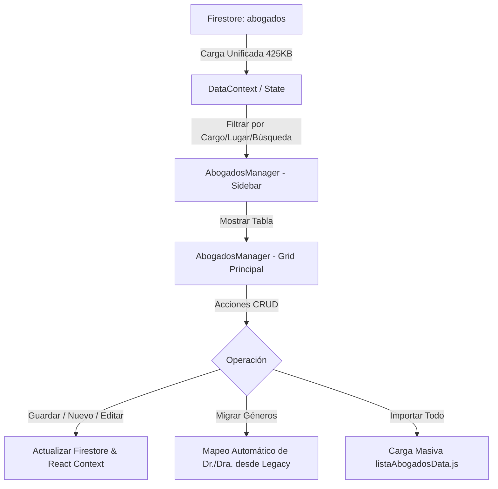

# ⚖️ Módulo: Gestión de Abogados (Abogados)

Este módulo gestiona el registro de profesionales judiciales (Jueces, Fiscales, Ayudantes Fiscales, Defensores Oficiales/Particulares y Ayudantes Defensores) que intervienen en las audiencias penales de la Oficina Judicial Penal (**OFIJUP**). Permite realizar filtros por cargo, lugar de procedencia, búsqueda inteligente, e importación masiva de datos estructurados para optimizar la persistencia y velocidad en Firestore.

---

## 📌 1. Arquitectura del Módulo y Estructura

El módulo expone una interfaz administrativa de tipo Grid (Tabla) con un panel de filtros lateral interactivo. Utiliza un esquema de datos altamente optimizado (modo económico) para reducir drásticamente el número de lecturas/escrituras en Firebase Firestore.

### Componentes de Código Clave
- **`page.jsx`**: Punto de entrada de la ruta. Envuelve la interfaz principal dentro de `AuthContext` y `DataContext`.
- **`AbogadosManager.jsx`**: Contenedor principal de la lógica de negocio, filtros laterales, ordenamiento y renderizado del Grid.
- **`AbogadoRow` / `NuevoAbogadoRow`**: Componentes funcionales para renderizar filas individuales, administrar estados locales de edición (`editing`) y confirmación de borrado.
- **`listaAbogadosData.js`**: Archivo de semillas/datos iniciales que almacena más de 5,000 registros para importación en lote limpia.

---

## ⚙️ 2. Reglas de Negocio Clave

### A. Estructura de Datos Compacta (Modo Económico)
> [!IMPORTANT]
> A diferencia de los modelos tradicionales de una colección por registro, todos los abogados se persisten en un único documento de Firestore.
- **Campos Mapeados:**
  - `m`: Matrícula del profesional (identificador único numérico).
  - `n`: Apellido y Nombre completo.
  - `t`: Teléfono/Contacto.
  - `c`: Cargo original asignado (`juez`, `fiscal`, `aFiscal`, `defensor`, `aDefensor`, `otros`).
  - `l`: Lugar físico o UFI asociada.
  - `s`: Indicador de género (`true` para femenino, `false` para masculino).

### B. Mapeo Automático de Género
- El sistema incluye una función de migración inteligente que detecta los prefijos honoríficos (`Dr.`, `Dra.`, `Juez`, `Jueza`) en los listados heredados para establecer de forma transparente la propiedad binaria de género (`s`), la cual es clave para el generador automatizado de oficios y notificaciones judiciales.

---

## 🔄 3. Flujos de Trabajo (Workflows)

### Workflow 1: Filtrado y Búsqueda Interactiva
1. El usuario interactúa con los switches laterales para aislar cargos específicos (ej. Juez, Fiscal).
2. Se calculan dinámicamente los contadores de badges en base al estado reactivo del contexto.
3. Se realiza una búsqueda insensible a mayúsculas y acentos sobre la matrícula o el nombre del profesional de forma local (sin consumo extra de API).

### Workflow 2: Migración e Importación Masiva
1. El administrador inicia el botón **Importar Datos**.
2. Se despliega un modal de advertencia indicando que se reemplazará la lista en Firestore con la semilla local compacta de 425KB.
3. Al confirmar, el sistema serializa el lote de registros y lo guarda en Firebase, actualizando el listado en memoria de todos los operadores concurrentes.

---

## 🚀 4. Trabajo Futuro y Mejoras Pendientes

### 📂 A. Validación de Matrículas Duplicadas
- **Problema:** En el componente `NuevoAbogadoRow` no se valida si la matrícula (`m`) ingresada manualmente ya existe en el padrón actual.
- **Solución Propuesta:** Impedir el envío del formulario si la matrícula colisiona con un registro existente y mostrar un mensaje Toast de advertencia.

### 🌐 B. Paginado Virtual en el Grid
- **Problema:** El renderizado directo de más de 5,000 elementos en el DOM puede enlentecer la pestaña si no se aplican filtros estrictos.
- **Solución Propuesta:** Implementar un scroll virtual (`react-virtualized`) para renderizar únicamente las filas visibles en pantalla y mejorar la tasa de refresco.
