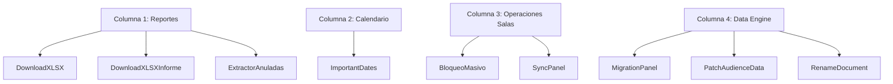

# 🛠️ Módulo: Administración Logística (Administracion-Logistica)

Este módulo centraliza todas las herramientas administrativas, de reporte, mantenimiento de datos y automatizaciones de bajo nivel necesarias para el funcionamiento diario de la Oficina Judicial Penal (**OFIJUP**). Actúa como la consola de control del operador logístico para corregir inconsistencias en Firestore, gestionar bloqueos de salas de audiencias y exportar métricas operativas.

---

## 📌 1. Arquitectura del Panel y Componentes

El módulo está diseñado en una distribución de 4 columnas especializadas que agrupan controles afines:

### Componentes de Código Clave
- **`page.jsx`**: Layout en grid de 4 columnas que monta el panel administrativo.
- **`DownloadXLSX.jsx` / `DownloadXLSXInforme.jsx`**: Exportadores de datos locales de audiencias a formato Excel (`.xlsx`) estructurado.
- **`ImportantDates.jsx`**: Gestor de hitos temporales y fechas límite operativas que influyen en los cálculos de plazos judiciales.
- **`BloqueoMasivo.jsx`**: Bloquea de forma masiva rangos horarios y salas para impedir agendamientos incorrectos.
- **`SyncPanel.jsx`**: Regenera la colección de lectura rápida (`audienciasView`) a partir de la colección de origen (`audiencias`) para resolver inconsistencias.
- **`PatchAudienceData.jsx`**: Permite inyectar conjuntos masivos de intervinientes y corregir documentos corruptos mediante parches controlados.

---

## ⚙️ 2. Reglas de Negocio Clave

### A. Sincronización Unidireccional y Consistencia
> [!IMPORTANT]
> La colección `audienciasView` es una caché de lectura rápida. `SyncPanel` realiza un merge atómico destructivo (`merge: false`) para garantizar que la caché sea idéntica a la colección base `audiencias`.
- Al sincronizar, el sistema lee el día completo desde `audiencias/{fecha}`, filtra los campos necesarios para la interfaz visual y escribe el documento consolidado en `audienciasView/{fecha}` de forma atómica para evitar desalineación de estados en tiempo real.

### B. Bloqueos de Salas
- **Formato de Ingreso:** Los operadores pueden bloquear salas ingresando rangos en formato `Sala | HH:MM | Legajo`. El sistema valida la no duplicidad y persiste los bloqueos directamente en Firebase.

---

## 🔄 3. Flujos de Trabajo (Workflows)

### Workflow 1: Re-sincronización de Audiencias del Día
1. El operador ingresa una fecha en formato `AAAA-MM-DD` en el panel `SyncPanel`.
2. El sistema recupera el listado original de audiencias y descarta campos pesados (historias de minutas, texto sin formatear).
3. Escribe el documento resultante limpio en la caché visual para re-establecer el orden en los dashboards.

### Workflow 2: Bloqueo de Salas Masivo
1. El operador ingresa una lista de legajos y salas a bloquear separados por saltos de línea.
2. El sistema parsea cada línea, comprueba colisiones, e inhabilita dichos bloques de agendamiento en el sistema Puppeteer de agendamiento masivo.

---

## 🚀 4. Trabajo Futuro y Mejoras Pendientes

### 📁 A. Modularización de Datos en PatchAudienceData
- **Problema:** El componente `PatchAudienceData.jsx` pesa más de 120KB debido a un listado JSON estático embebido de partes denunciantes.
- **Solución Propuesta:** Mover este JSON a un archivo estático separado (ej. `partsPatchData.json`) para facilitar la lectura del código del componente.
