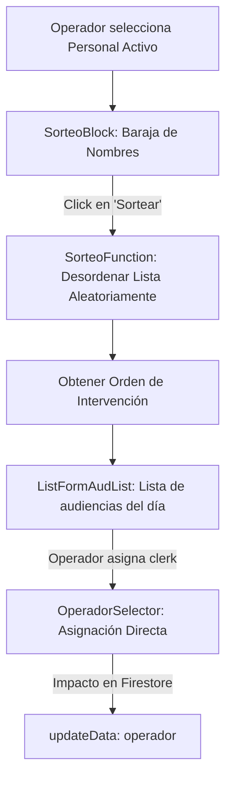

# 🎲 Módulo: Sorteo de Operadores (Sorteo-Operador)

Este módulo gestiona la asignación equitativa y aleatoria de los operadores judiciales (escribanos/operadores de sala) encargados de dar soporte a las audiencias diarias de la Oficina Judicial Penal (**OFIJUP**). Ofrece una interfaz de sorteo ("tómbola" digital) para barajar los nombres del personal activo y asignar las actas del día sin sesgos personales.

---

## 📌 1. Arquitectura del Sorteo y Asignación

El módulo se compone de dos paneles de trabajo integrados: la herramienta de sorteo aleatorio (izquierda) y la lista de asignación directa sobre las audiencias de la fecha (derecha).

### Componentes de Código Clave
- **`page.jsx`**: Entrada principal que coordina el estado de la fecha seleccionada y la carga de datos.
- **`SorteoBlock.jsx`**: Interfaz visual de la tómbola. Permite clickear nombres de operadores para pasarlos a la columna de "participantes".
- **`SorteoFunction.jsx`**: Algoritmo reactivo de desordenamiento pseudo-aleatorio que baraja y enumera el orden de asignación.
- **`ListFormAudList.jsx` / `ListIndiv.jsx`**: Panel que renderiza las audiencias programadas de la fecha seleccionada con sus respectivos campos de asignación.
- **`SorteoFilterBar.jsx`**: Permite al supervisor ordenar las audiencias por hora, tipo, juez o duración para emparejar la carga de trabajo compleja (ej. debates largos).
- **`OperadorSelector.jsx`**: Selector dropdown que asocia el operador elegido al documento de audiencia en Firestore (`operador`).

---

## ⚙️ 2. Reglas de Negocio Clave

### A. Algoritmo de Sorteo Limpio
- El sorteo se realiza localmente en base a la lista de operadores seleccionados por el supervisor. El sistema baraja los elementos y genera un ranking incremental. El supervisor utiliza esta secuencia ordenada para ir asignando de arriba a abajo en la lista de audiencias pendientes.

### B. Distribución Inteligente por Duración y Complejidad
> [!IMPORTANT]
> Se recomienda al supervisor utilizar los filtros de ordenamiento por **Duración** y **Colegiado** para asegurar que a los operadores sorteados no les coincidan múltiples audiencias extensas consecutivas.
- La propiedad `operador` modificada se guarda inmediatamente en Firestore en el campo homónimo, impactando en tiempo real en la barra de navegación del operador asignado.

---

## 🚀 3. Trabajo Futuro y Mejoras Pendientes

### 📊 A. Asignación Automatizada con 1 Click (Auto-Assign)
- **Problema:** Tras realizar el sorteo, el supervisor debe asignar manualmente el operador a cada audiencia haciendo click una por una.
- **Solución Propuesta:** Agregar un botón "Auto-Asignar" que asocie de forma secuencial y automática a los operadores ordenados en el sorteo a las audiencias libres de la grilla del día, considerando la no superposición horaria.
