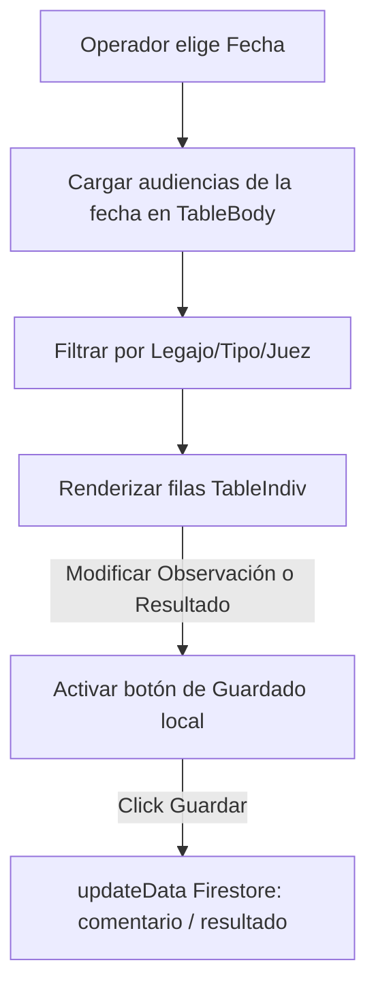

# 📋 Módulo: Control UAC (Control-UAC)

Este módulo provee una interfaz simplificada para el seguimiento, registro de comentarios y control de resultados de las audiencias pertenecientes a la Unidad de Administración de Casos (**UAC**) en la Oficina Judicial Penal. Facilita la carga rápida de minutas y resoluciones en tiempo real por fecha, optimizando la visualización de los estados del trámite.

---

## 📌 1. Arquitectura de Control de Casos

El flujo se centra en un listado tabular interactivo donde cada celda del listado representa una audiencia y permite ediciones directas en caliente (inline editing) de las observaciones y resultados.

### Componentes de Código Clave
- **`page.jsx`**: Gestiona el estado de la fecha seleccionada en el módulo (utilizando `localStorage` para persistencia en recargas) y la variable de filtro de texto.
- **`TableHead.jsx`**: Renderiza la barra de herramientas superior, el componente de selección de fecha y la caja de búsqueda/filtrado interactiva.
- **`TableBody.jsx`**: Recupera y mapea la colección de audiencias del día, aplicando filtros locales por coincidencia de texto.
- **`tableIndiv.jsx`**: Controla el estado local del texto de comentarios y resoluciones de una audiencia individual, mostrando un botón dinámico de "Guardar" únicamente cuando detecta cambios con respecto a Firestore.

---

## ⚙️ 2. Reglas de Negocio Clave

### A. Indicador de Estado Visual (Código de Color)
- El listado muestra un indicador circular de color (`⬤`) junto a la hora de cada audiencia que refleja directamente su estado técnico persistido:
  - `PROGRAMADA`: Indica que la sesión está agendada pero no iniciada.
  - `EN_PROCESO`: Audiencia activa en sala.
  - `CONCLUIDA`: Audiencia finalizada correctamente.
  - `SUSPENDIDA` / `REPROGRAMADA`: Estados de cancelación o cambio de agenda.

### B. Edición Ligera In-Place (Optimización del Operador)
> [!NOTE]
> Las actualizaciones sólo se envían a Firestore cuando el usuario pulsa explícitamente "Guardar" en la fila modificada, minimizando la latencia de red.
- Las dos columnas principales de texto (`Observaciones` y `Resultado`) se controlan mediante campos `<textarea>` para permitir múltiples líneas de texto sin romper la cuadrícula de la tabla.

---

## 🚀 3. Trabajo Futuro y Mejoras Pendientes

### 💾 A. Guardado Automático al Perder el Foco (Autosave)
- **Problema:** Si el operador escribe un comentario largo y cambia de pestaña o fecha sin pulsar el botón "Guardar", los cambios locales se pierden sin aviso.
- **Solución Propuesta:** Implementar un disparador `onBlur` o un efecto debounce en los inputs que guarde los cambios en segundo plano de manera automática tras unos segundos de inactividad de escritura.
