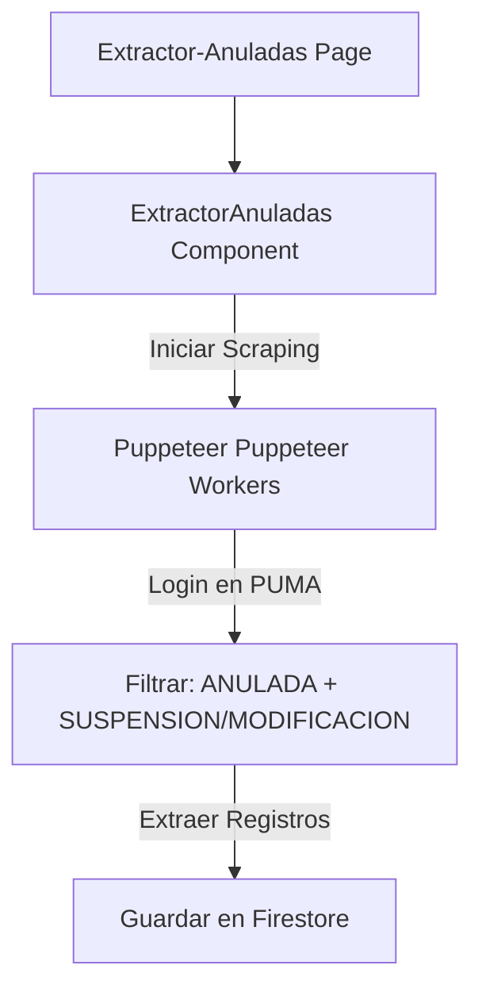

# 🌀 Módulo: Extractor de Solicitudes Anuladas (Extractor-Anuladas)

Este módulo expone la interfaz de ejecución del scraper especializado para recuperar solicitudes judiciales que han sido marcadas como **ANULADA** y cuyo tipo corresponde a **SUSPENSIÓN/MODIFICACIÓN** desde el portal judicial externo (**PUMA / UAL**). Utiliza el componente reutilizable del módulo de solicitudes y orquesta workers de automatización de navegador en segundo plano.

---

## 📌 1. Arquitectura de Integración

Este módulo actúa como una vista independiente que importa y expone el panel extractor consolidado en `Solicitudes-Audiencia`.

### Estructura de Código
- **`page.jsx`**: Punto de entrada que define metadatos SEO y monta el componente `ExtractorAnuladas`.
- **Componente Reutilizado**: `src/app/Solicitudes-Audiencia/components/ExtractorAnuladas.jsx` (Lógica e interfaz del extractor).

---

## ⚙️ 2. Reglas de Negocio Clave

### A. Criterio de Extracción
> [!IMPORTANT]
> El extractor solo recupera solicitudes que cumplan estrictamente con las siguientes dos condiciones en PUMA:
> 1. Estado de la Solicitud: **Anulada**.
> 2. Tipo de Solicitud: **Suspensión / Modificación de Audiencia**.
- Esto permite al personal de la Oficina Judicial identificar rápidamente cancelaciones tardías y liberar espacio físico en el cronograma de salas del día.

---

## 🚀 3. Trabajo Futuro y Mejoras Pendientes

### ⏱️ A. Programación de Tareas Cron en Servidor
- **Problema:** Actualmente, la extracción requiere que un operador abra manualmente el panel y pulse el botón "Iniciar Extracción".
- **Solución Propuesta:** Implementar un endpoint de API protegido en Next.js (ej. `/api/cron/extractor-anuladas`) que sea invocado periódicamente de forma automática por un servicio de tareas programadas (como Vercel Cron o cron local) para mantener las cancelaciones sincronizadas en tiempo real.
