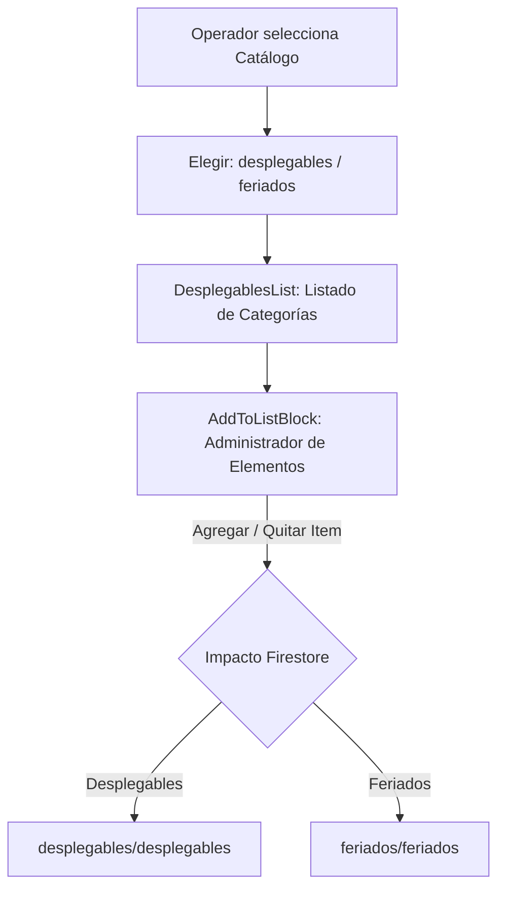

# 🗂️ Módulo: Listas Desplegables y Feriados (Listas-Desplegables)

Este módulo gestiona la administración de opciones predefinidas (catálogos) y el registro de feriados que regulan el comportamiento dinámico de los formularios de la Oficina Judicial Penal (**OFIJUP**). Permite agregar o eliminar elementos de los menús desplegables del sistema (jueces, salas, tipos de audiencias) y delimitar los días inhábiles en el calendario de planificación.

---

## 📌 1. Arquitectura de Catálogos Dinámicos

Las opciones cargadas se inyectan globalmente a través de `DataContext` y se propagan en tiempo real a todos los operadores.

### Componentes de Código Clave
- **`page.jsx`**: Entrada que envuelve el panel de control bajo contextos de seguridad y datos.
- **`ContextWrapper.jsx`**: Conecta los componentes de la interfaz con los métodos de mutación expuestos por `DataContext` (`addDesplegable`, `addFeriado`, etc.).
- **`Selector.jsx`**: Alterna entre la vista de catálogos generales (`desplegables`) y el listado de feriados nacionales (`feriados`).
- **`DesplegablesList.jsx`**: Muestra las colecciones de claves disponibles para editar (ej. *salas*, *ufi*, *motivoDemora*).
- **`AddToListBlock.jsx`**: Interface CRUD para añadir nuevos ítems de texto o eliminar existentes del array en Firestore.

---

## ⚙️ 2. Reglas de Negocio Clave

### A. Listas de Desplegables Soportadas
> [!IMPORTANT]
> Modificar las llaves base de desplegables puede afectar los formularios de creación de audiencias y la normalización de la información extraída de PUMA.
- **Categorías Administradas:**
  - `salas`: Habitaciones físicas habilitadas para audiencias.
  - `tipos`: Tipos de audiencias penales oficiales.
  - `ufi`: Unidades Fiscales de Investigación.
  - `motivoDemora`: Diccionario de justificaciones legales para demoras en sala.
  - `legajosPrefijo`: Siglas del sistema judicial (ej. *MPF-SJ*, *OJU-SJ*).

### B. Impacto de Feriados en Planificaciones
- Los feriados agregados bajo la sección `feriados` se guardan en formato `DDMMYYYY`. El planificador de juicios y los cronómetros leen directamente este array para saltar automáticamente estas fechas y no considerarlas hábiles.

---

## 🚀 3. Trabajo Futuro y Mejoras Pendientes

### 📋 A. Validaciones contra Elementos en Uso
- **Problema:** Actualmente es posible eliminar un tipo de audiencia o una UFI de la lista desplegable activa, incluso si existen audiencias activas programadas que dependen de dicho elemento, lo que genera inconsistencias visuales.
- **Solución Propuesta:** Antes de eliminar un elemento del catálogo, verificar si existen registros de audiencia en curso que lo utilicen y desplegar una advertencia de bloqueo.
