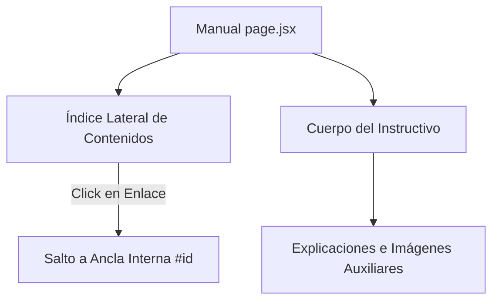

# 📖 Módulo: Instructivo de Usuario (Manual)

Este módulo expone la documentación interactiva y el manual de usuario oficial de la plataforma de la Oficina Judicial Penal (**OFIJUP**). Su propósito es guiar a los operadores judiciales en el uso correcto de cada módulo del sistema, detallando flujos de navegación, validaciones y códigos de color operativos.

---

## 📌 1. Arquitectura de Navegación del Manual

El instructivo está construido en base a una estructura de índice interactivo con hipervínculos internos (anclas de sección) y recursos visuales (capturas de pantalla y diagramas).

### Recursos Clave
- **`page.jsx`**: Renderiza el índice jerárquico de temas y la descripción detallada de cada módulo con capturas de pantalla de referencia.
- **`Manual.module.css`**: Proporciona el diseño a dos columnas (índice flotante + cuerpo de lectura) optimizado para pantallas panorámicas y lectura técnica.
- **Ruta de Imágenes (`/imgManual/`)**: Almacena las capturas del sistema que se cargan a través del componente optimizado `<Image>` de Next.js.

---

## ⚙️ 2. Estructura de Contenidos Clave

### A. Secciones Documentadas
- **Barra de Navegación:** Descripción del panel de íconos del margen izquierdo.
- **Tablero:** Guía sobre la vista diaria de audiencias programadas y sintaxis de la barra de búsqueda inteligente.
- **Agregar Audiencia:** Parámetros obligatorios de creación (Duración, Hora, Legajo, Tipos y Jueces).
- **Registro Audiencia:** Uso del cronómetro interactivo, cuarto intermedio y confección de minutas PDF.
- **Sorteo Operador:** Procedimiento de reparto equitativo de tareas.
- **Oficios:** Mapeo de códigos de estado de control y generación de oficios firmados.
- **Situación Corporal:** Seguimiento y estados de detención de imputados.

### B. Código de Colores de Control (Oficios)
> [!IMPORTANT]
> El manual enseña al operador a identificar visualmente el estado del trámite en la sección de Oficios mediante un código de color estricto en los íconos de carpetas:
- **Blanco:** Audiencia programada, no iniciada.
- **Celeste:** Audiencia finalizada sin resuelvo cargado.
- **Amarillo:** Finalizada con resuelvo completo pero sin control de oficio.
- **Rojo:** Controlada con correcciones pendientes por la UGA.
- **Verde:** Controlada y correcta para notificación.

---

## 🚀 3. Trabajo Futuro y Mejoras Pendientes

### 🔎 A. Buscador de Contenido Interno
- **Problema:** El manual es una página larga estática. Buscar un término específico requiere utilizar el atajo nativo del navegador (`Ctrl + F`).
- **Solución Propuesta:** Añadir una barra de búsqueda local superior con filtro dinámico sobre los títulos y párrafos del cuerpo del instructivo.
