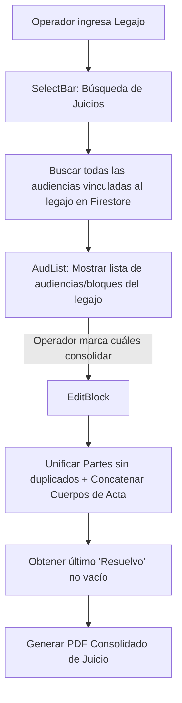

# 📄 Módulo: Minuta de Juicio (Minuta-Juicio)

Este módulo se especializa en la consolidación y generación de actas y minutas unificadas para juicios complejos que se extienden a lo largo de múltiples jornadas/bloques (Debates). Permite recuperar de forma síncrona todas las audiencias de tipo *DEBATE DEL JUICIO ORAL* asociadas a un número de legajo en Firebase, consolidar sus contenidos y partes intervinientes, y descargar un documento PDF final unificado con una única carátula.

---

## 📌 1. Arquitectura del Motor de Consolidación

El motor de minutas de juicio realiza una consulta agregada y unifica arrays de datos locales para estructurar la minuta consolidada.

### Componentes de Código Clave
- **`page.jsx`**: Layout base que monta la barra de selección y envuelve el contexto de datos.
- **`SelectBar.jsx`**: Permite al usuario buscar y filtrar por legajo para recuperar las audiencias correspondientes desde Firestore.
- **`AudList.jsx`**: Renderiza el panel de checkboxes donde el operador puede marcar o desmarcar qué bloques específicos del juicio quiere integrar en la minuta final (permitiendo omitir cuartos intermedios no sustanciales).
- **`EditBlock.jsx`**: Componente de gran envergadura (44KB) que implementa el motor de fusión de datos, el formulario de edición de partes y el generador de PDF consolidado.

---

## ⚙️ 2. Reglas de Fusión y Consolidación de Datos

### A. Unificación de Intervinientes (Partes)
- El sistema recorre las audiencias seleccionadas y realiza una unión matemática (sin duplicidad de DNI o nombres) para consolidar en un solo listado a todos los Jueces, Fiscales, Imputados, Defensores, Querellantes y Testigos que hayan comparecido en cualquiera de las jornadas de juicio.

### B. Concatenación Cronológica de Minutas
- Los cuerpos de texto de cada jornada de debate se concatenan en orden cronológico ascendente (por fecha y hora) utilizando separadores formales que identifican claramente el inicio de cada sesión del juicio.

### C. Resolución del Debate ("Resuelvo")
> [!IMPORTANT]
> El sistema busca y arrastra automáticamente el texto del campo `Resuelvo` del último bloque del debate que contenga texto, asumiendo que es allí donde se dictó la sentencia o veredicto final del juicio.
- El operador puede corregir este campo consolidado en `EditBlock` antes de la impresión final del PDF.

---

## 🚀 3. Trabajo Futuro y Mejoras Pendientes

### 📂 A. Guardado de la Minuta Fusión en Firestore
- **Problema:** Actualmente, la consolidación ocurre en caliente en el estado local de React. Si el operador realiza modificaciones en el texto fusionado en `EditBlock`, no se guardan en una colección central, por lo que debe volver a consolidar si recarga la página.
- **Solución Propuesta:** Crear una colección de soporte `minutasConsolidadas` en Firestore para almacenar la versión final del acta y posibilitar revisiones posteriores rápidas.
