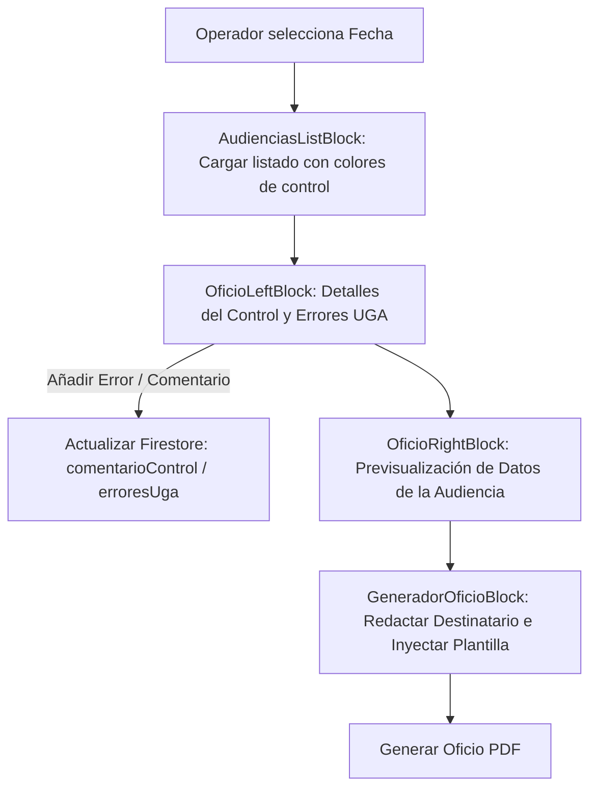

# ✉️ Módulo: Control de Actas y Generación de Oficios (Oficios)

Este módulo gestiona la auditoría de calidad de las actas de audiencias y la posterior emisión de notificaciones oficiales (Oficios judiciales) dirigidas a los distintos organismos intervinientes (Unidades Fiscales, Defensorías, Servicio Penitenciario, etc.). Permite registrar observaciones de la Unidad de Gestión de Audiencias (**UGA**), marcar errores técnicos y generar documentos PDF firmados digitalmente.

---

## 📌 1. Arquitectura de Control y Emisión de Oficios

La interfaz divide las responsabilidades entre la columna de selección e inspección (izquierda) y la columna de previsualización y redacción del oficio (derecha).

### Componentes de Código Clave
- **`page.jsx`**: Layout a dos columnas (`OficioLeftBlock` y `OficioRightBlock`) sincronizado por el ID de la audiencia activa.
- **`AudienciasListBlock.jsx` / `AudienciasListIndiv.jsx`**: Renderiza las audiencias del día con íconos de colores representativos de su estado de control (blanco, celeste, amarillo, rojo, verde).
- **`ControlButtonsBlock.jsx`**: Botones rápidos para marcar la audiencia como "CONTROLADA" o "CON CORRECCIONES".
- **`ErroresUgaList.jsx`**: Lista interactiva para añadir/remover de forma granular ítems de error detectados en el acta (ej. *Falta DNI*, *Fecha errónea*, *Divergencia de Juez*).
- **`GeneradorOficioBlock.jsx`**: Panel de redacción de oficios. Permite seleccionar destinatarios, autocompletar cargos (Dr./Dra. ajustando pronombres según género) e imprimir el PDF.

---

## ⚙️ 2. Reglas de Negocio Clave

### A. Semántica de Estados de Control
> [!IMPORTANT]
> Los estados de control determinan el progreso administrativo y se guardan en la propiedad `controlState` de la audiencia en Firestore:
- `PENDIENTE` (Ícono Amarillo): Audiencia finalizada con datos cargados, en espera de auditoría.
- `CORREGIR` (Ícono Rojo): Se detectaron observaciones. El sistema bloquea la emisión de oficios definitivos hasta que el operador de sala subsane los errores listados en `ErroresUgaList`.
- `OK` (Ícono Verde): Acta correcta. Se habilita el generador de oficios.

### B. Generador Inteligente de Oficios
- **Ajuste de Género:** Al redactar un oficio judicial a una autoridad, el sistema recupera el campo de género del profesional (`s` en la base de abogados) y ajusta automáticamente la redacción del saludo: *"Al Señor Juez"* / *"A la Señora Jueza"*, *"Al Doctor"* / *"A la Doctora"*.
- **Destinatarios Predeterminados:** Permite autocompletar con UFI específicas, comisarías, juzgados de garantías o defensores oficiales.

### C. Integración con el Sistema de Reincidencia
- **Detección Automática de Destinatario:** Al agregar como destinatario de un oficio al `"REGISTRO NACIONAL DE REINCIDENCIA "`, el sistema detecta de forma inteligente este valor en la lista de entradas de oficios.
- **Inserción de Advertencia y Plantilla Estructurada:** Automáticamente, añade al campo de `traslado` una nota indicando que la remisión de la ficha dactiloscópica debe ser gestionada por el organismo solicitante ante el Departamento de Antecedentes Personales de la Policía, junto con una plantilla estructurada con los siguientes campos clave para completar el pedido:
  - **TIPO:** PEDIDO de informes o RESOLUCIÓN, SENTENCIA o TESTIMONIO judicial
  - **ORGANISMO:** nombre del organismo judicial
  - **CAUSA:** número de causa
  - **PRIORIDAD:** (no completar)
  - **DELITO:** descripción del delito
  - **RESOLUCIÓN:** sentencia condenatoria, sobreseimiento, etc.
  - **DNI:** número de DNI
  - **SEXO:** MASCULINO o FEMENINO
  - **FECHA DE NACIMIENTO:** formato DD/MM/AAAA (Prestar especial atención al formato)
  - **NACIONALIDAD:** nacionalidad del causante
  - **DATOS DE FILIACIÓN:** apellidos/nombres del causante, y de su padre y madre.
- **Prevención de Duplicados:** Valida que el fragmento de la nota informativa y la plantilla de reincidencia no se agreguen múltiples veces si el usuario realiza modificaciones consecutivas en la lista de destinatarios.

---

## 🚀 3. Trabajo Futuro y Mejoras Pendientes

### 📧 A. Envío Automático por Correo / API
- **Problema:** El sistema genera un archivo PDF para su descarga local, obligando al operador a enviarlo manualmente por correo electrónico o subirlo a PUMA.
- **Solución Propuesta:** Integrar un servicio de correo electrónico en el backend (ej. SendGrid o SMTP corporativo) para despachar el oficio en PDF con un sólo click directamente a las casillas institucionales de las partes oficiadas.
