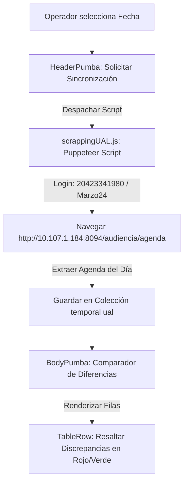

# 🐆 Módulo: Integración y Comparador PUMA (Pumba)

Este módulo gestiona la interoperabilidad entre el sistema local de actas y el portal judicial oficial heredado de la Provincia de San Juan (**PUMA / UAL**). A través de un motor de scraping automatizado en Puppeteer, el sistema extrae las agendas programadas directamente de PUMA para contrastarlas en una grilla de auditoría comparativa, permitiendo identificar discrepancias de horario, salas físicas asignadas, o magistrados intervinientes.

---

## 📌 1. Arquitectura de Integración PUMA

El extractor de PUMA opera en un esquema híbrido: corre mediante APIs en servidor en la versión web y vía IPC (Inter-Process Communication) en la versión de escritorio basada en Electron.

### Componentes de Código Clave
- **`page.jsx`**: Layout maestro del comparador.
- **`HeaderPumba.jsx`**: Barra superior de control. Inicializa los listeners de progreso y ejecuta el scraping mediante streams SSE (Server-Sent Events) o IPC de Electron.
- **`scrappingUAL.js`**: Script modular de Puppeteer. Implementa la autenticación en el portal judicial, la navegación por el calendario dinámico, y el parseo de las tablas de audiencias y notificaciones.
- **`BodyPumba.jsx`**: Realiza los cruces lógicos en memoria entre la colección local `audiencias` y la extraída `ual`.
- **`TableRow.jsx`**: Celda de comparación celda a celda. Compara campos (Sala, Hora, Juez, Tipo) y activa alertas visuales de inconsistencia.

---

## ⚙️ 2. Reglas de Negocio y Comparación Estricta

### A. Detección de Discrepancias
> [!IMPORTANT]
> El sistema audita de forma estricta los siguientes campos clave. Cualquier discrepancia activa un resaltado rojo de alerta en la celda correspondiente:
1. **Hora de Inicio:** Compara la hora agendada local contra la de PUMA.
2. **Sala / Espacio Físico:** Identifica si la audiencia fue movida de sala en PUMA sin avisar a logística.
3. **Juez:** Compara la composición unipersonal o colegiada.

### B. Parámetros de Conexión de Red (Debuda Intranet)
- El scraper utiliza la IP de la intranet del Poder Judicial (`http://10.107.1.184:8092`) y credenciales de servicio parametrizadas. Las credenciales de acceso se encuentran documentadas en el almacén de deuda técnica para su posterior migración a variables de entorno `.env`.

---

## 🚀 3. Trabajo Futuro y Mejoras Pendientes

### 🔑 A. Seguridad de Credenciales y Ambientes
- **Problema:** El usuario de acceso (`20423341980`) y la contraseña (`Marzo24`) están declarados de forma explícita en el archivo `scrappingUAL.js`.
- **Solución Propuesta:** Mover estas credenciales a variables de entorno (`process.env.PUMA_USER` y `process.env.PUMA_PASSWORD`) para que no se expongan en el repositorio de código.
