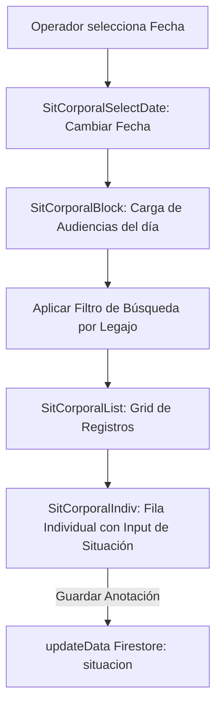

# 🔒 Módulo: Situación Corporal (Situacion-Corporal)

Este módulo centraliza el seguimiento y control de la situación de detención (cárcel, prisión domiciliaria, libertad, traslados del servicio penitenciario o dependencias policiales) de los imputados convocados a audiencias en la Oficina Judicial Penal (**OFIJUP**). Su finalidad es facilitar la coordinación logística de los traslados y custodias para evitar suspensiones de audiencias por incomparecencia física.

---

## 📌 1. Arquitectura de Control de Custodia

El módulo provee una interfaz ágil que lee la planificación diaria de audiencias y permite realizar anotaciones de seguridad y traslados directamente sobre cada registro.

### Componentes de Código Clave
- **`page.jsx`**: Punto de acceso que envuelve el panel en los contextos de autenticación y carga de Firestore.
- **`SitCorporalBlock.jsx`**: Contenedor principal que maneja los filtros de búsqueda y la suscripción de datos para la fecha seleccionada.
- **`SitCorporalSelectDate.jsx`**: Componente de cabecera con selectores de fecha optimizados.
- **`SitCorporalList` / `SitCorporalIndiv.jsx`**: Lista interactiva de audiencias. El componente individual expone un campo de texto para editar la situación y un indicador visual de guardado.

---

## ⚙️ 2. Reglas de Negocio Clave

### A. Trazabilidad de Traslados
- La propiedad `situacion` de una audiencia contiene información crítica para el personal de seguridad judicial (ej. *"Requiere traslado de Unidad 1 Chimbas"*, *"Detenido en Comisaría 2da"*).
- El sistema permite que el personal administrativo actualice este campo desde la planificación temprana (`Agregar-Audiencia`), el registro en sala (`Registro-Audiencia`) o este panel logístico especializado.

### B. Código de Color Visual para Seguridad
- Si una audiencia contiene algún comentario de situación corporal registrado (lo que indica que hay un imputado privado de libertad involucrado), la fila correspondiente en el dashboard de control resalta con un fondo gris claro diferenciado para alertar a los oficiales de enlace.

---

## 🚀 3. Trabajo Futuro y Mejoras Pendientes

### 👮 A. Integración con Fuerza Policial y Penitenciaría (Mesa de Entradas)
- **Problema:** La coordinación de traslados se realiza mediante oficios impresos o correos. El personal de policía de tribunales no puede ver este panel directamente.
- **Solución Propuesta:** Crear un perfil de usuario limitado para enlaces policiales que les permita únicamente visualizar y confirmar de recibido los traslados programados en esta pantalla.
