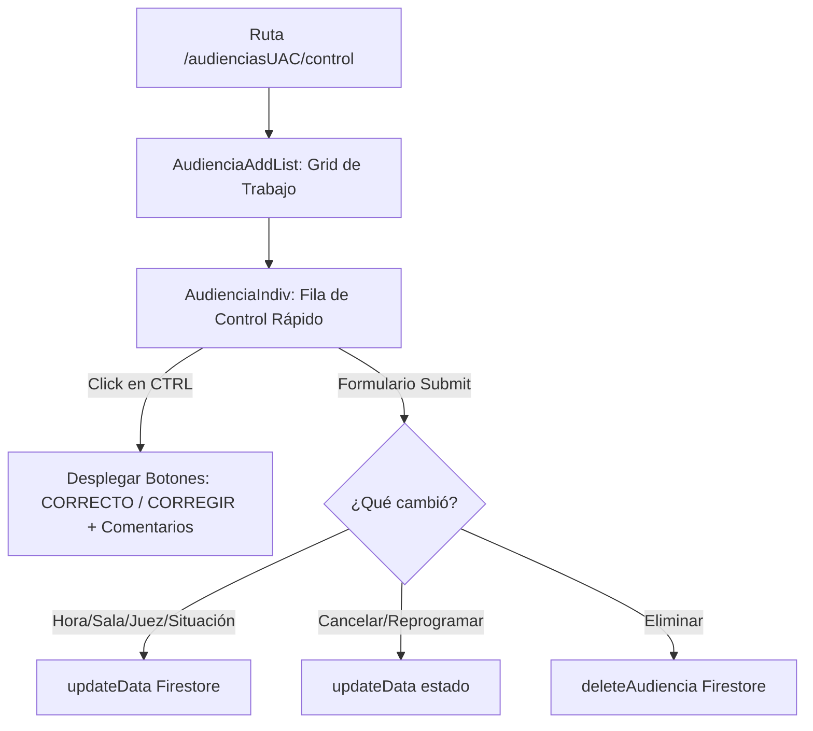

# 🏛️ Módulo: Control y Gestión de Audiencias UAC (audienciasUAC)

Este módulo expone la consola de control unificada para la Unidad de Administración de Casos (**UAC**). Permite supervisar la planilla diaria de audiencias, auditar la calidad de los datos del acta (marcar como correcto o solicitar correcciones), reasignar jueces de control secundario, modificar horas y programaciones, y lanzar notificaciones (oficios) sin necesidad de entrar a la minuta completa.

---

## 📌 1. Arquitectura de Control UAC

El módulo se compone de una vista de control principal (`AudienciaAddList`) que consume la base de datos diaria y expone filas de edición rápida (`AudienciaIndiv`).

### Componentes de Código Clave
- **`page.jsx`**: Entrada base del módulo.
- **`control/page.jsx`**: Inyecta los proveedores e inicializa `AudienciaAddList` con la fecha activa de los parámetros de Next.js.
- **`AudienciaAddList.jsx`**: Estructura las cabeceras de la grilla de control de audiencias (Iniciales del Admin, Estado de Control, Hora, Legajo, Tipo, Juez, Juez Secundario, Situación, Resultado y Acciones).
- **`AudienciaIndiv.jsx`**: Celda interactiva de gran dinamismo. Implementa la lógica local de detección de cambios (`checkEditing`), controles booleanos de eliminación/cancelación y switches del flujo de control (`correcto` / `controlado`).
- **`Oficio.jsx`**: Popup flotante simplificado para despachar oficios inmediatos.

---

## ⚙️ 2. Reglas de Negocio Clave

### A. Iniciales del Administrador (`admin`)
- Cada audiencia cuenta con un campo libre `admin` en el que los secretarios de la UAC ingresan sus iniciales para responsabilizarse del agendamiento y control del trámite en el sistema judicial.

### B. El panel de Control Rápido (Acceso Directo `CTRL`)
> [!IMPORTANT]
> Al presionar el botón `CTRL` de una fila, la celda horaria se transforma temporalmente en un selector de auditoría directa para que el supervisor UGA marque la sesión de forma inmediata como correcta o requiriendo corrección, redactando observaciones inline.
- Esto evita tener que navegar a la pantalla dedicada de `Oficios` para marcar las correcciones del día.

### C. Reasignación de Juez Secundario (`juezN`)
- El panel permite asociar de forma independiente un juez de control secundario (`juezN`) utilizando las iniciales del catálogo activo de jueces para simplificar la firma de providencias y resoluciones de trámite.

---

## 🚀 3. Trabajo Futuro y Mejoras Pendientes

### 🗓️ A. Sincronización Automática con Calendario de la Corte
- **Problema:** Los cambios de horario e inhabilitaciones ingresados en esta planilla de control de UAC deben cargarse manualmente en los cronogramas individuales de cada juzgado.
- **Solución Propuesta:** Conectar un disparador (Cloud Function) que actualice automáticamente las agendas personales de los magistrados involucrados cuando la UAC modifique una hora en esta interfaz.
