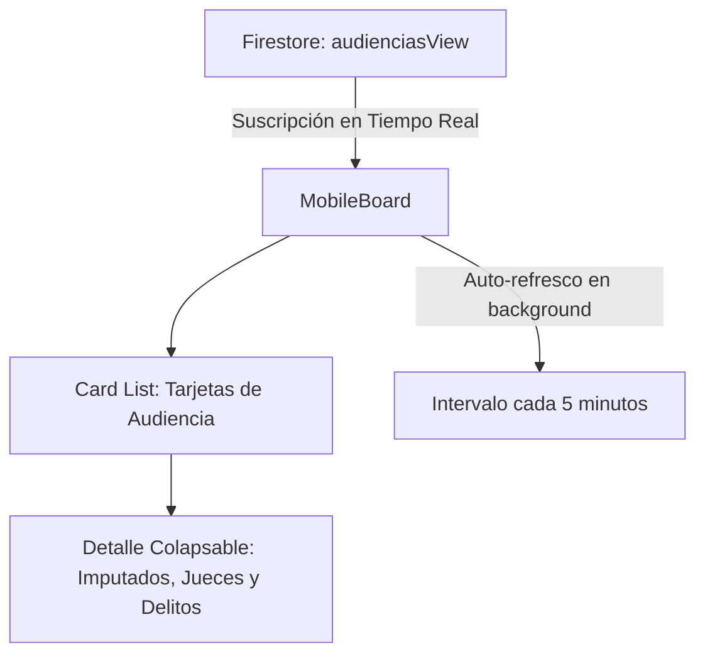

# 📱 Módulo: Tablero de Control Móvil (celular)

Este módulo provee una interfaz móvil responsiva y de bajo consumo de datos (`MobileBoard`) optimizada para teléfonos inteligentes y tablets. Está diseñado específicamente para los secretarios y oficiales de seguridad que patrullan las salas y pasillos del palacio de justicia, permitiéndoles consultar al instante el estado de cada audiencia sin necesidad de una computadora de escritorio.

---

## 📌 1. Arquitectura de Visualización Móvil

El módulo carga los datos dinámicos a través de `DataContext` y los renderiza en un diseño de tarjetas adaptativas colapsables de alto contraste.

### Componentes de Código Clave
- **`page.jsx`**: Entrada que inicializa el contexto móvil de Next.js.
- **`MobileBoard.jsx`**: Administra la lógica de filtrado rápido, temporizadores de refresco pasivos y renderiza la lista de tarjetas colapsables.
- **`MobileBoard.module.css`**: Hoja de estilos optimizada con Vanilla CSS para interacciones táctiles (touch targets, paddings amplios y paleta oscura de bajo consumo de batería).

---

## ⚙️ 2. Reglas de Negocio Clave

### A. Auto-Refresco Pasivo en Segundo Plano
- Para minimizar el consumo de batería y el uso del plan de datos móviles del personal de pasillo, la interfaz no mantiene un WebSocket continuo de Firebase si se detecta inactividad. En su lugar, ejecuta una llamada de refresco ligera cada 5 minutos (`setInterval` a 300,000ms).

### B. Densidad de Información Progresiva
> [!IMPORTANT]
> El diseño móvil prioriza el estado visual inmediato y oculta detalles secundarios.
- La tarjeta cerrada sólo muestra la **Sala**, **Hora**, **Legajo** y un badge de color según el estado.
- Al tocar la tarjeta, se despliega progresivamente la carátula, los nombres de imputados, defensores y fiscales intervinientes.

---

## 🚀 3. Trabajo Futuro y Mejoras Pendientes

### 🔔 A. Notificaciones Push de Cambios de Sala / Urgencias
- **Problema:** Si se produce un cambio repentino de sala de última hora, el oficial de pasillo no lo sabrá hasta que refresque la pantalla.
- **Solución Propuesta:** Integrar Firebase Cloud Messaging (FCM) para enviar alertas push de vibración directamente al celular del operador si se reprograma o modifica una sala asignada en su zona.
