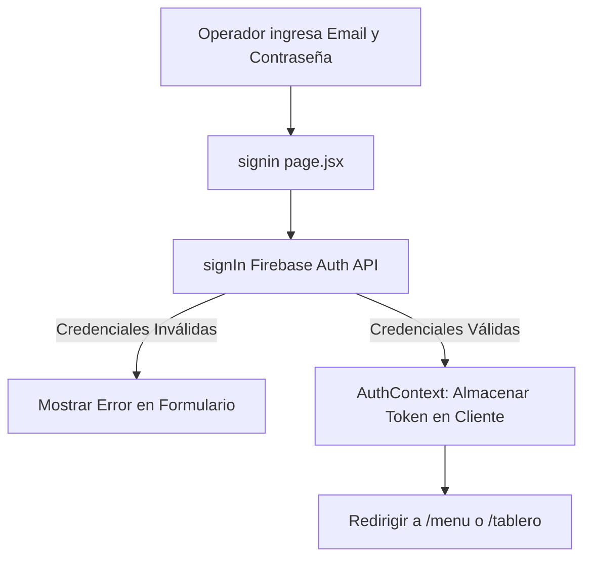

# 🔑 Módulo: Autenticación e Inicio de Sesión (signin)

Este módulo gestiona la seguridad, control de acceso e inicio de sesión de los operadores de la Oficina Judicial Penal (**OFIJUP**). Utiliza la suite de **Firebase Authentication** para validar las credenciales de los usuarios, restringir accesos no autorizados a las vistas administrativas y mantener sesiones seguras mediante JSON Web Tokens (JWT) persistidos en cookies y memoria del cliente.

---

## 📌 1. Arquitectura del Flujo de Autenticación

El inicio de sesión redirige a los usuarios hacia el tablero de control tras verificar su estado de autenticación.

### Componentes de Código Clave
- **`page.jsx`**: Punto de acceso a la pantalla de login.
- **`signin.jsx`**: Formulario interactivo de inicio de sesión que gestiona los estados de validación local (Email con formato válido, longitud de contraseña) y los errores devuelvos por Firebase.
- **`signin.module.css`**: Hoja de estilos con animaciones sutiles en los inputs y diseño oscuro adaptativo (Dark Mode).

---

## ⚙️ 2. Reglas de Negocio Clave

### A. Contexto Global de Autenticación (`AuthContext`)
- Todas las páginas sensibles del sistema se envuelven en el proveedor `AuthContextProvider`. Este proveedor intercepta la carga de la página, lee la sesión activa de Firebase y, si el usuario no ha iniciado sesión, realiza una redirección automática (soft redirect) a `/signin`.

### B. Control de Errores Semánticos
> [!IMPORTANT]
> El sistema traduce los códigos de error técnicos de Firebase Auth a mensajes legibles en español:
- `auth/user-not-found` ➔ *"El correo electrónico no se encuentra registrado."*
- `auth/wrong-password` ➔ *"Contraseña incorrecta. Por favor, intente nuevamente."*
- `auth/invalid-email` ➔ *"El formato del correo electrónico ingresado no es válido."*

---

## 🚀 3. Trabajo Futuro y Mejoras Pendientes

### 🔐 A. Roles y Permisos (RBAC)
- **Problema:** Actualmente, cualquier cuenta de correo registrada tiene acceso total a todos los módulos (incluyendo paneles de control destructivos en Logística).
- **Solución Propuesta:** Implementar Custom Claims en los tokens de Firebase Auth (ej. `role: 'admin'`, `role: 'operator'`) para habilitar o deshabilitar componentes en base al rol del usuario en la Oficina Judicial.
