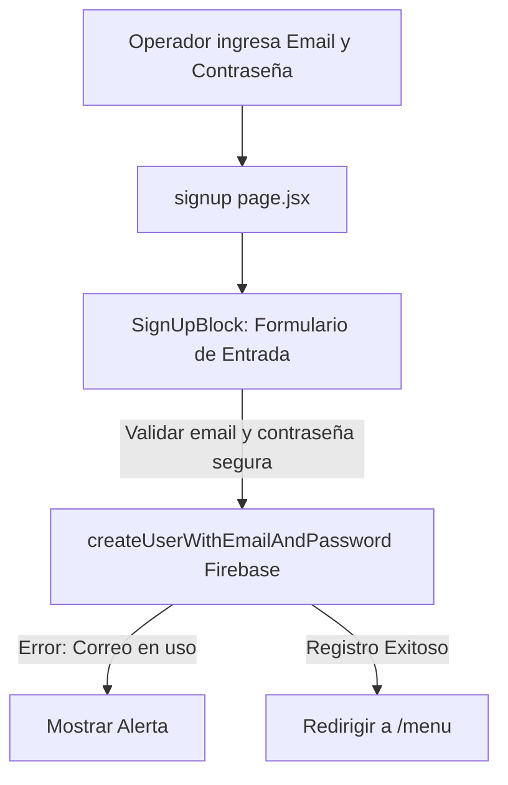

# 📝 Módulo: Registro de Nuevos Usuarios (signup)

Este módulo gestiona el registro de nuevos operadores judiciales en el sistema de la Oficina Judicial Penal (**OFIJUP**). Permite dar de alta cuentas de acceso vinculadas al correo institucional, estableciendo las bases del control de sesiones en Firebase.

---

## 📌 1. Arquitectura del Flujo de Registro

El registro interactúa directamente con el motor de creación de usuarios de Firebase.

### Componentes de Código Clave
- **`page.jsx`**: Entrada que expone el bloque de registro.
- **`SignUpBlock.jsx`**: Formulario que gestiona el registro, validación y redirección tras creación exitosa.
- **`SignUpBlock.module.css`**: Estructura de diseño para el registro.

---

## ⚙️ 2. Reglas de Negocio Clave

### A. Requisitos de Contraseña Segura
> [!IMPORTANT]
> El formulario valida la fortaleza básica de la contraseña antes de enviarla a Firebase para mitigar riesgos de seguridad:
- Longitud mínima de 6 caracteres.
- Coincidencia exacta de contraseñas si se agrega un campo de confirmación.

---

## 🚀 3. Trabajo Futuro y Mejoras Pendientes

### 🔒 A. Aprobación Manual de Cuentas (Admin Whitelisting)
- **Problema:** En el esquema actual, cualquier persona con acceso a la red de la intranet puede crear un usuario y acceder a los datos de las audiencias.
- **Solución Propuesta:** Implementar un estado inactivo por defecto para las cuentas creadas (`active: false`) y habilitar una consola de administración en Logística donde un supervisor deba activar de forma explícita las nuevas cuentas antes de permitirles iniciar sesión.
