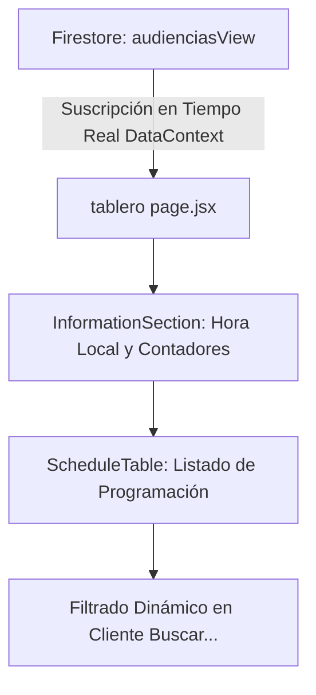

# 📊 Módulo: Tablero de Control Diario (tablero)

Este módulo es la pantalla principal de monitoreo en tiempo real de las audiencias programadas para el día corriente en la Oficina Judicial Penal (**OFIJUP**). Su propósito es servir como un visor informativo unificado de rápido acceso para coordinadores, fiscales, defensores y el público en general, detallando el estado actual de las salas de audiencias.

---

## 📌 1. Arquitectura del Tablero de Control

El flujo se basa en la lectura de la colección optimizada `audienciasView` para renderizar de manera reactiva la tabla de programación del día.

### Componentes de Código Clave
- **`page.jsx`**: Entrada que inicializa los componentes de visualización y suscribe al contexto de datos.
- **`Clock.jsx`**: Renderiza el reloj digital de hora local del palacio de tribunales en tiempo real.
- **`InformationSection.jsx` / `InfoBlock.jsx`**: Muestra las métricas resumidas del día (ej. total de audiencias programadas, en proceso y concluidas).
- **`ScheduleTable.jsx`**: Tabla interactiva optimizada para alta velocidad de lectura. Implementa la barra de filtrado multivariado en cliente.

---

## ⚙️ 2. Reglas de Negocio Clave

### A. Filtrado Inteligente Multivariado
- La barra de búsqueda superior permite concatenar criterios de búsqueda separados por espacios. Por ejemplo, al escribir `"Sala 1 IPP"`, el sistema filtra localmente e instantáneamente las filas de la tabla para mostrar únicamente las audiencias de tipo *IPP* programadas en la *Sala 1*.

### B. Semántica Visual de Estados en Sala
> [!IMPORTANT]
> Cada fila de audiencia posee una barra lateral o indicador de color que representa su situación en tiempo real:
- **⬤ PROGRAMADA (Gris/Blanco):** La audiencia está en horario pero no ha comenzado.
- **⬤ EN PROCESO (Azul):** El cronómetro de sala está corriendo; la sesión se está llevando a cabo.
- **⬤ CONCLUIDA (Verde):** El operador finalizó el acta y la sesión terminó.
- **⬤ SUSPENDIDA / REPROGRAMADA (Rojo/Naranja):** La sesión se canceló por motivos técnicos o procesales.

---

## 🚀 3. Trabajo Futuro y Mejoras Pendientes

### 📺 A. Modo Kiosco (Pantallas de Pasillo)
- **Problema:** El tablero incluye barras de navegación e inputs que no deberían ser visibles cuando se proyecta en las pantallas de los pasillos de tribunales para información al público.
- **Solución Propuesta:** Crear una ruta `/tablero/publico` (Modo Kiosco) que oculte los menús laterales de administración, deshabilite interacciones y aumente el tamaño de la tipografía para lectura a distancia.
